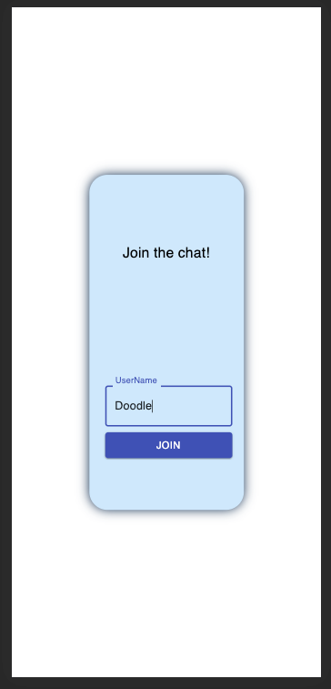
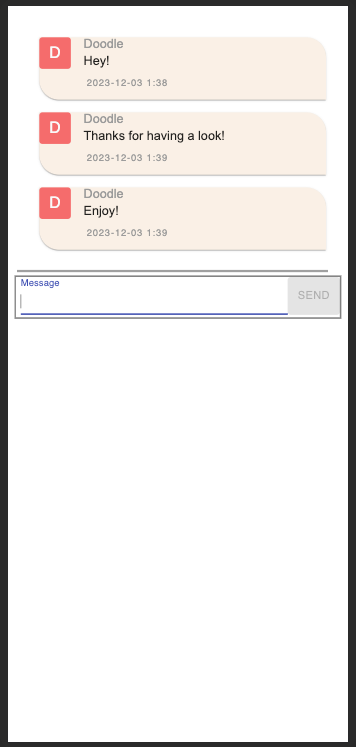

# Getting Started with the Chat App

A simple Chat application based
- backend
- frontend

## OutLine

This simple page has two pages 
- Landing page 
- Chat page

They look as follows. You first select your userName then enter the chat room to continue!

## Requirements
You need to have Java 14+ and Docker in order to run following

## How to RUN the App

1. Build a docker image of the chat-api
#### `cd backend`
#### `mvn clean package`

2. Build docker compose
#### `cd ..`
#### `docker-compose up`

